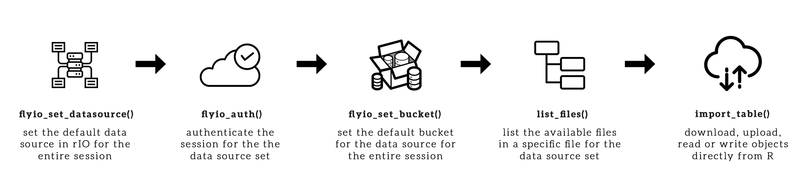

# flyio - Make data fly to R 
Input Output data from R - Download, upload, read, write objects from AWS S3, GoogleCloudStorage or local file system with a single interface. Read the manual [here](https://github.com/socialcopsdev/flyio/blob/master/wiki/flyio-manual.pdf)

## Overview

**flyio** provides a common interface to interact with data from cloud storage providers or local storage directly from R. Currently supporting AWS S3 and GoogleCloudStorage, thanks to the API wrappers provided by cloudyr. **flyio** also supports tables, rasters, shapefiles, and R objects to be read or written to the data source from memory.



  - `flyioSetDataSource()`: set the data source (gcs, s3, local) for all the other functions in flyio
  - `flyioAuth()`: authenticate data source (gcs or s3) so that you have access to the data. In a single session different data sources can be authenticated
  - `flyioSetBucket()`: set the bucket name once for any or both data sources so that you don't need to write it in each function
  - `listFiles()`: list the files in the bucket/folder
  - `fileExists()`: check if a file exists in the bucket/folder
  - `fileUpload()`: upload a file to S3 or GCS from your local file system
  - `fileDownload()`: download a file from S3 or GCS 
  - `read[Table/Raster/Shp/Rds/Rda]()`: Read a file from the set data source and bucket from a user defined function
  - `write[Table/Raster/Shp/Rds/Rda]()`: Write a file to the set data source and bucket from a user defined function
 
## Installation

Generate Personal Access Token, since this is a private repo: <br />
  - Go to https://github.com/settings/tokens <br />
  - Click "Generate a personal access token" 
  - Tick 'repo' <br />
  - Scroll to the bottom and click "Generate token"<br />
  - Enter "flyio" in the token description box<br />
  - Copy the token <br />
<br />
In R, run the following command:

``` r
# Install the latest dev version from GitHub:
install.packages("devtools")
devtools::install_github("socialcopsdev/flyio", auth_token = "paste token copied above")

# Load the library
library(flyio)
```

### Example

``` r
# Setting the data source
flyio_set_datasource("gcs")

# Verify if the data source is set
flyio_get_datasource()

# Authenticate the default data source and set bucket
flyio_auth("key.json")
flyio_set_bucket("socialcops-flyio")

# Authenticate S3 also
flyio_auth(c("AWS_ACCESS_KEY_ID", "AWS_SECRET_ACCESS_KEY", "AWS_DEFAULT_REGION", "AWS_SESSION_TOKEN"), data_source = "s3")
flyio_set_bucket("socialcops-flyio", data_source = "s3")

# Listing the files in GCS
list_files(path = "test", pattern = "*csv")

# Saving mtcars to all the data sources using default function write.csv
export_table(mtcars, "~/Downloads/mtcars.csv", data_source = "local")
export_table(mtcars, "test/mtcars.csv") # saving to GCS, need not mention as set globally
export_table(mtcars, "test/mtcars.csv", data_source = "s3")

# Check if the file written exists in GCS
file_exists("test/mtcars.csv")

# Read the file from GCS using readr library
mtcars <- import_table("test/mtcars.csv", FUN = readr::read_csv)

```

## References
* Cloudyr GCS Wrapper: https://github.com/cloudyr/googleCloudStorageR
* Cloudyr S3 Wrapper: https://github.com/cloudyr/aws.s3


